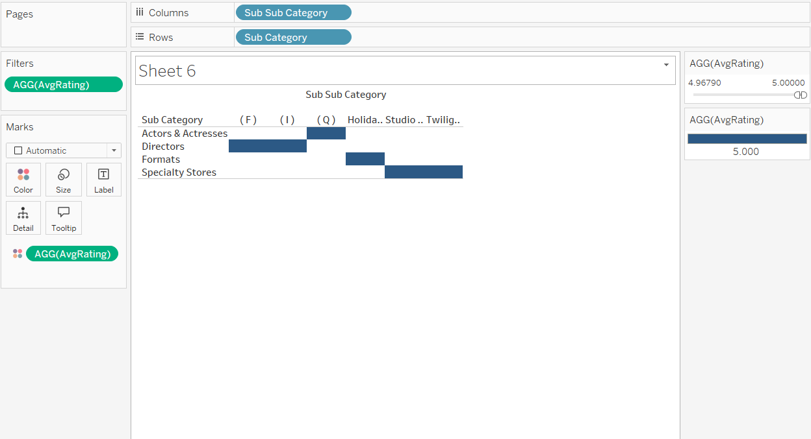
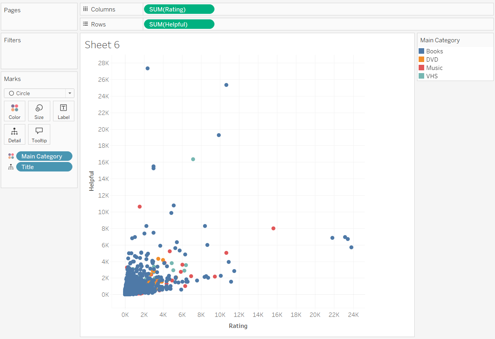
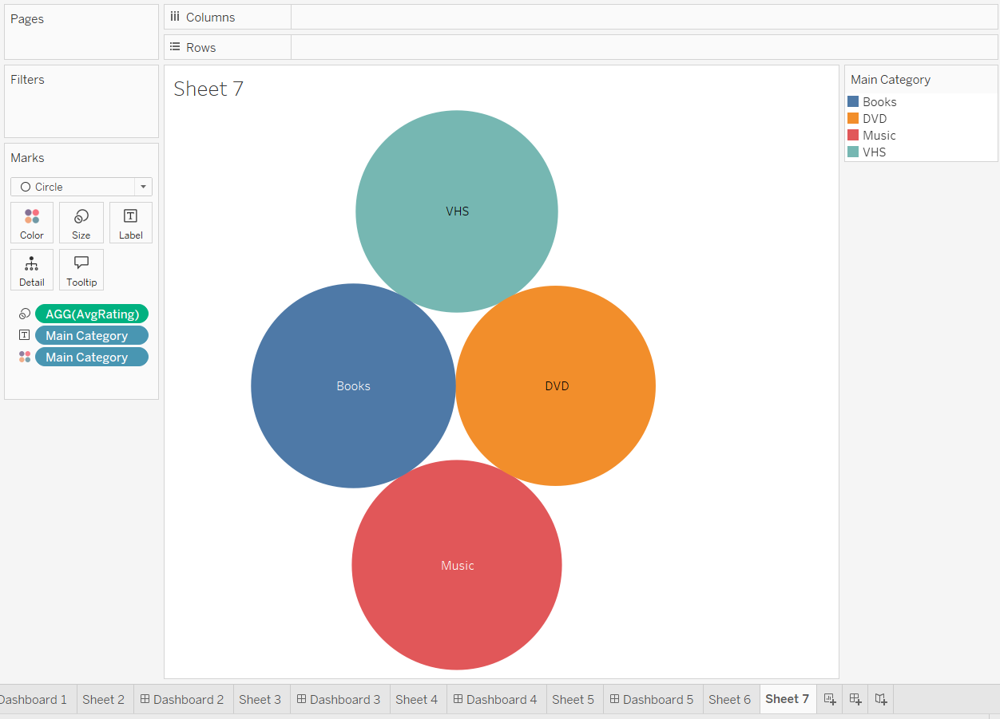
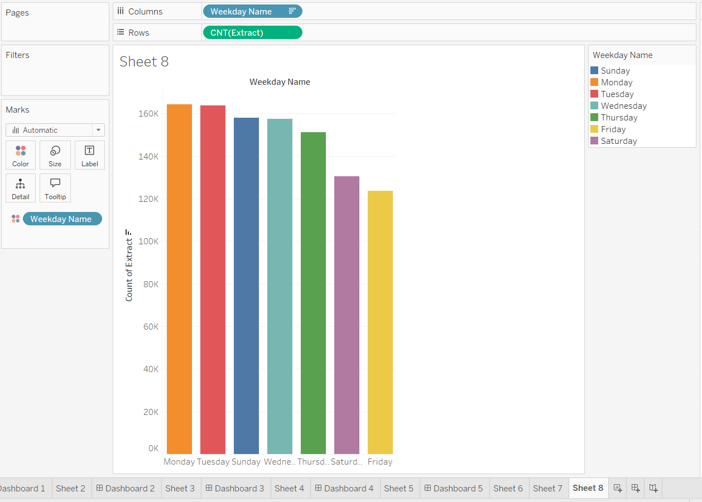
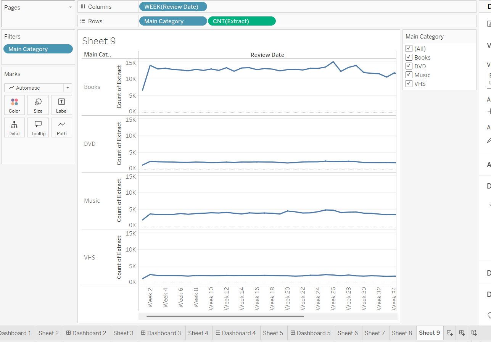

# Assignment 2: Customer Review Analysis using Tableau

**Overview**:  
In this assignment, I performed an in-depth analysis of customer reviews for various products (Books and DVDs) using Tableau. A subset of the full dataset was used due to hardware limitations, with the original 70GB dataset being too large for processing on my laptop. The dataset was cleaned and calculated fields were added for **Year, Month, Quarter, Weekday**, and **Product Category** (Main, Sub, Sub-Sub, Final). The aim was to uncover actionable business insights related to customer engagement and product feedback.

# 📊 Business Insights & Critical Questions Answered

## 📁 Dataset Overview

This project analyzes customer reviews for various products such as Books and DVDs using Tableau. Calculated fields were created for **year, month, quarter, weekday**, and category levels (**main, sub, sub-sub, final**). The goal is to extract actionable business insights.

---

## ❓ Question 1: Which sub-sub-categories have the highest avg rating?

**Insight**: Sub-sub-categories like *Holiday Greeting Cards* and *Studio Specials* have the highest average ratings.

---

## ❓ Question 2: Are helpful votes linked to higher product ratings?

**Insight**: There’s a no correlation between higher ratings and helpful votes.

---

## ❓ Question 3: How do DVDs and Books differ in review sentiment?

**Insight**: They don't differ much.

---

## ❓ Question 4: What day of the week do customers leave the most reviews?

**Insight**: Most reviews are posted on Mondays and Tuesdays, likely due to weekend shopping and reflection time.

---

## ❓ Question 5: Which products show suspicious spikes in review activity?

**Insight**: Books show a sudden spikes during certain weeks, indicating a potential review manipulation.

---

## 📌 Conclusion

This Tableau dashboard helps detect product engagement trends, trust factors, and suspicious review activity, allowing businesses to:

- Improve product quality
- Detect fraud
- Optimize customer engagement

